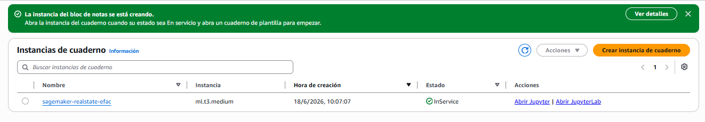
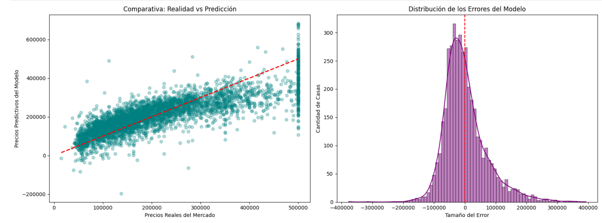

# AI Real Estate Agent
# Predicción de precios de viviendas con Amazon SageMaker

Este proyecto forma parte de mi formación en Cloud Computing. El objetivo inicial era utilizar Amazon SageMaker Canvas, una herramienta visual que permite crear modelos de Inteligencia Artificial sin escribir código, para adivinar el precio de las viviendas en función de sus características (como el número de habitaciones o la zona donde se encuentran). 

El propósito de este repositorio es explicar los problemas que encontré con los permisos de la cuenta de AWS, cómo los solucioné cambiando de estrategia y el código que utilicé para crear el modelo definitivo.

---

## Servicios de la Nube Utilizados

Para realizar este proyecto he trabajado en la nube de Amazon Web Services (AWS) utilizando las siguientes herramientas:

* **Amazon SageMaker:** La plataforma principal de AWS para trabajar con Inteligencia Artificial y modelos predictivos.
* **Instancias de Cuaderno (Notebook Instances):** Servidores virtuales dedicados que permiten abrir el entorno JupyterLab para escribir e instalar scripts en Python de forma aislada y segura.
* **Amazon S3:** El servicio de almacenamiento en la nube donde se guardan los archivos de datos utilizados.

---

## Cómo ejecutarlo localmente

```bash
git clone [https://github.com/edgarfariza/AI-Real-State-Agent.git](https://github.com/edgarfariza/AI-Real-State-Agent.git)
cd AI-Real-State-Agent
pip install -r requirements.txt
jupyter notebook notebook/prediccion_viviendas.ipynb
```
## El Problema de Negocio (Sector Inmobiliario)

El ejercicio se basa en un caso real del sector inmobiliario. Contamos con una tabla de datos (dataset) que incluye información de muchas viviendas: su ubicación por coordenadas, la antigüedad del edificio, el número de habitaciones, los dormitorios y el nivel económico de los vecinos de la zona. 

El objetivo es entrenar al sistema para que aprenda la relación que hay entre todos esos datos y sea capaz de calcular, de forma automática, el precio de una casa. 

### Utilidad para una Empresa:
Tener un modelo que calcule los precios de forma automática permite a una inmobiliaria:
* Tasar los pisos mucho más rápido nada más entrar en la cartera.
* Encontrar chollos o casas que están a la venta por debajo del precio real del mercado.
* Poner precios de venta basados en estadísticas reales y no en una simple intuición.

---

## Desarrollo Paso a Paso

### 1. Bloqueo de Permisos y Cambio de Estrategia
Al intentar abrir la herramienta visual SageMaker Canvas dentro del laboratorio de la universidad, el sistema me denegó el acceso con un error de tipo `AccessDeniedException`. Esto ocurrió porque las cuentas de estudiante vienen muy limitadas de fábrica y no tienen permisos para activar ciertas opciones de usuario en AWS (como el Identity Center o el Resource Access Manager).


Como no podía cambiar los permisos de la cuenta, decidí solucionar el problema como programador: en lugar de usar la interfaz visual sin código, creé una **Instancia de Cuaderno tradicional (Notebook Instance)** de tipo `ml.t3.medium` usando el rol con los permisos que ya venían configurados en el laboratorio (`LabRole`). Esta vía trabaja de forma independiente, esquiva el bloqueo y me permitió continuar con el proyecto escribiendo el código yo mismo.



### 2. Carga de Datos y Gráfica de Relaciones
Una vez dentro de JupyterLab, subí el archivo `housing.csv` del taller, abrí un archivo nuevo de Python 3 y cargué la tabla con los datos. Como la máquina venía totalmente limpia de fábrica, lo primero que tuve que hacer fue instalar las librerías necesarias ejecutando los comandos `!pip install seaborn` y `!pip install scikit-learn` directamente en las celdas.

Para entender mejor la información antes de entrenar al sistema, pinté un mapa de calor. Esta gráfica muestra de forma visual qué características influyen más en que una casa sea más cara o más barata. Al mirar los resultados, se ve claro que la columna `median_income` (el sueldo de la zona) es la que más fuerza tiene a la hora de subir el precio de la vivienda (`median_house_value`), con un valor de 0.69.

```python
import pandas as pd
import seaborn as sns
import matplotlib.pyplot as plt

# 1. Cargamos el archivo CSV oficial del taller de AWS
df = pd.read_csv('housing.csv')

# 2. Mostramos en pantalla las primeras 3 filas para comprobar los datos
print("Primeras filas del archivo del taller:")
print(df.head(3))

# 3. Dibujamos el mapa de calor usando solo las columnas numéricas
plt.figure(figsize=(10, 6))
sns.heatmap(df.corr(numeric_only=True), annot=True, cmap='Dark2', fmt='.2f')
plt.title('Matriz de Correlación - Dataset Oficial de AWS')
plt.show()
```


### 3. Entrenamiento del Modelo de Predicción
Para poder entrenar al sistema, primero tuve que hacer una pequeña limpieza en la tabla de datos. Eliminé las filas que tenían celdas vacías en la columna de los dormitorios (`total_bedrooms`) para evitar que el código diera errores de compilación. Además, quité la columna `ocean_proximity` porque contiene texto (como "NEAR BAY") y los modelos predictivos solo entienden de números.

Después, separé los datos en dos grupos: utilicé el 80% de las casas para que el algoritmo estudiara las características y aprendiera los precios, y me guardé el 20% restante bloqueado para poder hacerle un examen final al sistema más adelante. 

Para este proyecto utilicé un algoritmo clásico llamado **Regresión Lineal**. Básicamente, lo que hace este algoritmo es analizar todas las variables numéricas de entrada (los ingresos de la zona, las habitaciones, la antigüedad...) y trazar una línea de tendencia recta para calcular de forma automatizada el precio final de la vivienda (`median_house_value`). A nivel de código, es programación pura orientada a objetos: instanciamos un objeto de la clase `LinearRegression` y llamamos a su método `.fit()` pasándole los datos de entrenamiento por parámetro.

```python
from sklearn.model_selection import train_test_split
from sklearn.linear_model import LinearRegression

# 1. Limpiamos las celdas vacías para evitar fallos
df_clean = df.dropna()

# 2. Separamos las columnas de datos del precio final
X = df_clean.drop(columns=['median_house_value', 'ocean_proximity'])
y = df_clean['median_house_value']

# 3. Dividimos en grupo de estudio (80%) y grupo de examen (20%)
X_train, X_test, y_train, y_test = train_test_split(X, y, test_size=0.2, random_state=42)

# 4. Ponemos al algoritmo a estudiar los datos
model = LinearRegression()
model.fit(X_train, y_train)

print("¡Modelo entrenado con éxito usando los datos del taller!")
```
### 4. Examen del Modelo y Resultados de Precisión
Para comprobar si el sistema había aprendido correctamente, le pasé las casas del grupo de examen (el 20%) para que intentara calcular sus precios sin ver la solución. Al comparar sus predicciones con los precios reales del mercado, el script calculó las dos notas de rendimiento finales:

* **Error Cuadrático Medio (MSE):** Mide la media de los fallos del modelo elevados al cuadrado. Cuanto más bajo sea este valor, más cerca habrán estado las predicciones de los precios reales.
* **Coeficiente de Determinación (R2 Score):** Es la nota de examen del modelo en una escala del 0 al 1. Nuestro script devuelve un valor de **0.6401**, lo que significa que este código en Python tiene un **64% de acierto general** a la hora de estimar el valor de las viviendas utilizando los datos del taller de AWS.

```python
from sklearn.metrics import mean_squared_error, r2_score

# El modelo intenta adivinar los precios del grupo de examen
y_pred = model.predict(X_test)

# Calculamos las notas de rendimiento finales
mse = mean_squared_error(y_test, y_pred)
r2 = r2_score(y_test, y_pred)

print(f"Error Cuadrático Medio (MSE): {mse:.4f}")
print(f"Porcentaje de acierto o Coeficiente (R2 Score): {r2:.4f}")
```


### 5. Análisis Gráfico de los Resultados
Para ir más allá de los números y entender visualmente cómo se comporta el modelo, generé dos gráficas adicionales en el cuaderno que muestran de forma muy clara dónde acierta el algoritmo y cómo se distribuyen sus fallos.

```python
# Creamos una pantalla con dos gráficas paralelas
fig, (ax1, ax2) = plt.subplots(1, 2, figsize=(16, 6))

# Gráfica 1: Precios Reales vs Predicciones
ax1.scatter(y_test, y_pred, alpha=0.3, color='teal')
ax1.plot([y_test.min(), y_test.max()], [y_test.min(), y_test.max()], 'r--', lw=2)
ax1.set_xlabel('Precios Reales del Mercado')
ax1.set_ylabel('Precios Predictivos del Modelo')
ax1.set_title('Comparativa: Realidad vs Predicción')

# Gráfica 2: Distribución de los Errores (Residuos)
errores = y_test - y_pred
sns.histplot(errores, kde=True, ax=ax2, color='purple')
ax2.axvline(x=0, color='r', linestyle='--')
ax2.set_xlabel('Tamaño del Error')
ax2.set_ylabel('Cantidad de Casas')
ax2.set_title('Distribución de los Errores del Modelo')

plt.tight_layout()
plt.show()
```


### Gráfica 1: Comparativa de Realidad vs Predicción.

Esta gráfica nos representa cada casa del grupo del examen con un punto azul. La linea roja discontinua representa la franja donde el precio real y el precio adivinado coinciden exactamente.
Al ver que la nube de puntos azules se agrupa siguiendo la dirección de la línea roja, confirmamos visualmente que el modelo sigue la tendencia real del mercado. Si los puntos estuvieran completamente dispersos como una diana rota, significaría que el modelo estaría calculando los precios al azar.

### Gráfica 2: Distribución de los Errores
Esta gráfica nos muestra cuanto se desvían las predicciones del modelo respecto a la línea roja discontinua central, que representa el cero.
La gráfica tiene forma de campana y la mayoría de los datos se concentran alrededor de la línea central. Esto es una excelente señal técnica, ya que demuestra que la gran mayoría de los errores del algoritmo son pequeños (cercanos a cero) y que el modelo no tiene un sesgo grave que le haga calcular siempre los precios al alza o a la baja.

## Limpieza de la Cuenta

Para cumplir con las buenas prácticas de administración en la nube, optimizar el uso de los recursos y evitar consumir créditos del laboratorio de forma innecesaria, he procedido a apagar la infraestructura utilizada una vez terminado el ejercicio:

1. Guardé los cambios del cuaderno `.ipynb` y cerré el entorno de JupyterLab.
2. Volví al panel de control de Amazon SageMaker, seleccioné mi instancia de cuaderno (`sagemaker-realestate-efac`) y utilicé el botón **Acciones -> Detener (Stop)**.
3. Confirmé que el estado de la máquina cambió de `InService` a `Stopped`, garantizando así el coste cero en la cuenta del laboratorio tras la realización de las capturas de pantalla de este proyecto.


## Reflexión Final, Aprendizajes y Aplicación Empresarial

### 1. Limitaciones de las Herramientas Visuales frente al Código
Este proyecto me ha servido para comprobar que las herramientas visuales sin código (como Canvas) son muy cómodas y rápidas para un análisis inicial, pero dependen demasiado de tener todos los permisos de infraestructura abiertos en la nube. Al final, tener una base sólida de programación en primero de DAM y saber defenderme con scripts me ha permitido salvar el proyecto de forma independiente, levantando una solución idéntica escribiendo el código a mano mediante una Instancia de Cuaderno tradicional de SageMaker. Esto demuestra que un bloqueo de permisos en la nube (`AccessDeniedException`) no detiene el proyecto si se tiene flexibilidad y capacidad para resolver problemas escribiendo código.

### 2. Investigación de Conceptos de Machine Learning
Al cambiar de estrategia y pasar a desarrollar la solución en Python, me tocó investigar conceptos técnicos que no habíamos visto en el curso:

* **El Algoritmo de Regresión Lineal:** Entendí que no es magia negra, sino un algoritmo clásico que analiza variables numéricas de entrada y traza de forma automática una línea recta de tendencia para calcular el precio final de una casa. Conseguir un 64% de acierto (`R2 Score: 0.6401`) con un dataset real de más de 20.000 viviendas demuestra que los datos tienen una lógica interna que la IA puede aprender rápidamente.
* **Métricas de Evaluación:** Para saber si el modelo funcionaba bien o mal, investigué qué significaban el Error Cuadrático Medio (MSE), que calcula la media de los fallos elevados al cuadrado, y el Coeficiente de Determinación (R2 Score), que funciona como la nota del examen del algoritmo. 
* **Ecosistema de Librerías de Python:** Al venir de programar en Java, tuve que investigar herramientas nuevas de análisis de datos como `pandas` (para limpiar celdas vacías mediante `dropna()`), `seaborn` y `matplotlib` (para las gráficas) y `scikit-learn` (para instanciar el modelo como un objeto y usar métodos como `.fit()` y `.predict()`).

### 3. Limitaciones del Modelo Técnico
Como desarrollador, es importante entender los límites de lo que hemos construido. La regresión lineal traza una línea recta de tendencia, pero el mercado inmobiliario real es mucho más complejo y rara vez se comporta de forma lineal. Para subir la precisión en el futuro, habría que investigar algoritmos basados en árboles de decisión. Además, el dataset analiza factores fijos, pero no tiene en cuenta variables del mundo real que cambian constantemente, como el estado de conservación de la vivienda, las reformas recientes, la inflación o los tipos de interés.

### 4. Aplicación en el Entorno Empresarial (Valor de Negocio)
Si tuviéramos que implantar este sistema en una empresa inmobiliaria real, su aplicación práctica generaría un impacto inmediato en el negocio mediante dos estrategias claras:

* **Filtro Rápido de Oportunidades (Inversión):** El departamento de compras podría programar este script para escanear de forma automática portales inmobiliarios. Si el sistema detecta un piso cuyo precio de venta real está muy por debajo del precio que predice nuestro modelo, saltaría una alerta automática para adquirir una propiedad infravalorada antes que la competencia.
* **Tasación Automatizada para Captación de Clientes:** Se podría integrar este código detrás de una API web en la página de la inmobiliaria. De este modo, un usuario de la calle podría rellenar un formulario con los datos de su casa y el sistema le devolvería una tasación inicial aproximada en segundos, capturando un cliente potencial para la empresa de forma automatizada gracias a la infraestructura cloud.

